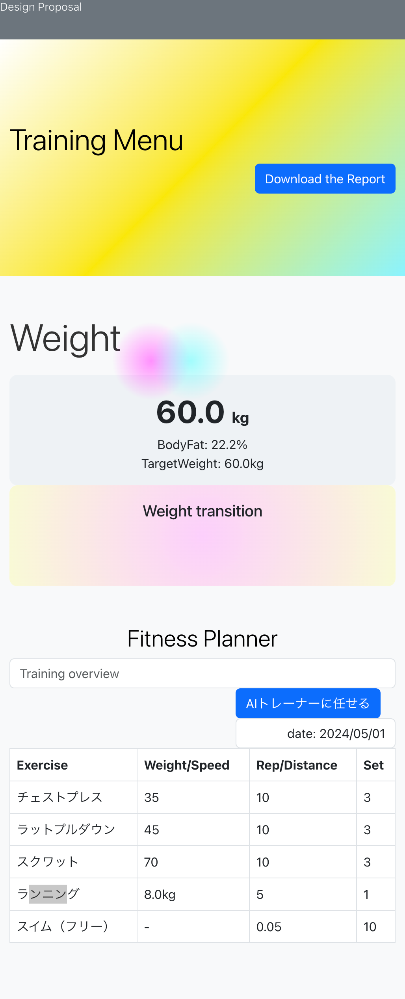

## 概要

トレーニングメニューアプリを作成。

## 機能
- 身長・体重・BMI・体脂肪率の管理
- トレーニングメニューの管理
- AIによるトレーニングメニューの提案

## 環境
- python
- Django
- React

## React追加モジュール
```
npm install react-chartjs-2 chart.js
```
- [react-chartjs-2 使い方まとめ](https://zenn.dev/saito2321/articles/85cfe362749f37)

## フロント画面(デザイン)

